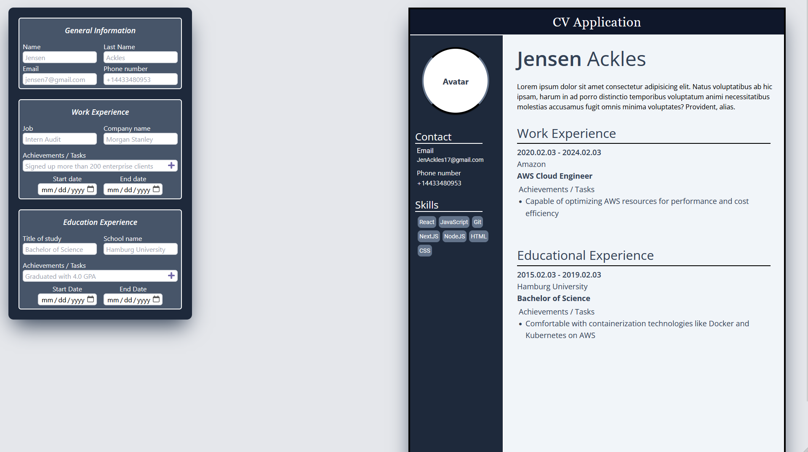

# cv-application
Creating a CV Application using React JS and Tailwind 

Still in process of adding more features and making the project responsive

The goal of this repo is to practice the following skill sets:

 
   - **React**:
        - `useState`
        - `lifting state up`
        - `passing down props`
        
   - **Tailwind**: 
        - `syntax`
        - `grid`
        - `flex-box`
        - `min-max properties`

## Links

[Live Demo](https://cv-application-fawn-ten.vercel.app)

## Screenshots

> Normal View / Desktop Layout (1980x1080 Viewport)

